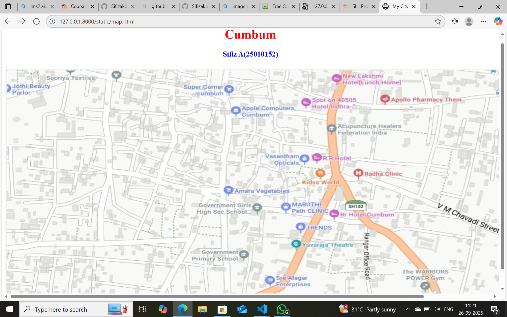
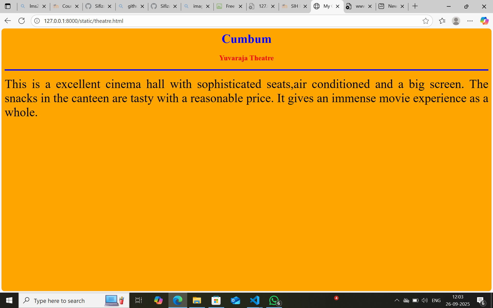
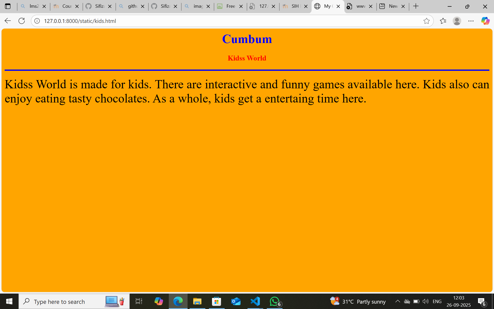
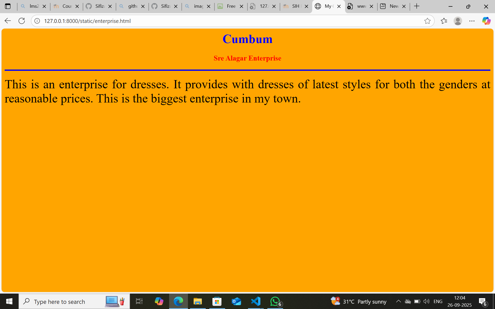
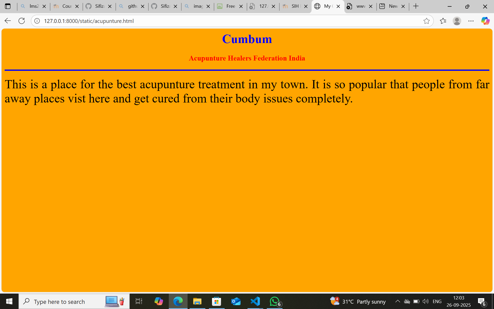

# Ex04 Places Around Me
## Date: 26.09.2025

## AIM
To develop a website to display details about the places around my house.

## DESIGN STEPS

### STEP 1
Create a Django admin interface.

### STEP 2
Download your city map from Google.

### STEP 3
Using ```<map>``` tag name the map.

### STEP 4
Create clickable regions in the image using ```<area>``` tag.

### STEP 5
Write HTML programs for all the regions identified.

### STEP 6
Execute the programs and publish them.

## CODE
```
map.html
<html>
    <head>
        <title>
            My City
        </title>
    </head>
    <body>
        <h1 align="center">
            <font color="red"><b>Cumbum</b></font>
        </h1>
        <h3 align="center">
            <font color="blue"><b>Sifiz A(25010152)</b></font>
        </h3>
        <center>
            
            <map name="MyCity">
    <area target="" alt="Yuvaraja Theatre" title="Yuvaraja Theatre" href="theatre.html" coords="590,423,759,456" shape="rect">
    <area target="" alt="Kidss World" title="Kidss World" href="kids.html" coords="710,248,810,295" shape="rect">
    <area target="" alt="Rr Hotel Cumbum" title="Rr Hotel Cumbum" href="rr.html" coords="752,346,896,386" shape="rect">
    <area target="" alt="Sre Alagar Enterprises" title="Sre Alagar Enterprises" href="enterprise.html" coords="622,509,727,548" shape="rect">
    <area target="" alt="Acupunture Healers Federation India" title="Acupunture Healers Federation India" href="acupunture.html" coords="746,134,907,171" shape="rect">
</map>
            </map>
        </center>
    </body>
</html>

theatre.html
<html>
    <head>
        <title>
            My City
        </title>
    </head>
    <body bgcolor="orange">
        <h1 align="center">
            <font color="blue"><b>Cumbum</b></font>
        </h1>
        <h3 align="center">
            <font color="red"><b>Yuvaraja Theatre</b></font>
        </h3>
        <hr size="4" color="blue">
        <p align="justify">
            <font face="italics" size="6">
                This is a excellent cinema hall with sophisticated seats,air conditioned and a big screen. The snacks in the canteen are tasty with a reasonable price. It gives an immense movie experience as a whole.
            </font>
        </p>

    </body>
</html>

kids.html
<html>
    <head>
        <title>
            My City
        </title>
    </head>
    <body bgcolor="orange">
        <h1 align="center">
            <font color="blue"><b>Cumbum</b></font>
        </h1>
        <h3 align="center">
            <font color="red"><b>Kidss World</b></font>
        </h3>
        <hr size="4" color="blue">
        <p align="justify">
            <font face="italics" size="6">
                Kidss World is made for kids. There are interactive and funny games available here. Kids also can enjoy eating tasty chocolates. As a whole, kids get a entertaing time here.
            </font>
        </p>

    </body>
</html>

rr.html
<html>
    <head>
        <title>
            My City
        </title>
    </head>
    <body bgcolor="orange">
        <h1 align="center">
            <font color="blue"><b>Cumbum</b></font>
        </h1>
        <h3 align="center">
            <font color="red"><b>Rr Hotel Cumbum</b></font>
        </h3>
        <hr size="4" color="blue">
        <p align="justify">
            <font face="italics" size="6">
                This hotel is for the tourists. It provides tasty food for the customers. Sophisticated rooms and parking facilities are available at reasonable costs. 
            </font>
        </p>

    </body>
</html>

enterprise.html

<html>
    <head>
        <title>
            My City
        </title>
    </head>
    <body bgcolor="orange">
        <h1 align="center">
            <font color="blue"><b>Cumbum</b></font>
        </h1>
        <h3 align="center">
            <font color="red"><b>Sre Alagar Enterprise</b></font>
        </h3>
        <hr size="4" color="blue">
        <p align="justify">
            <font face="italics" size="6">
                This is an enterprise for dresses. It provides with dresses of latest styles for both the genders at reasonable prices. This is the biggest enterprise in my town. 
            </font>
        </p>

    </body>
</html>

acupunture.html
<html>
    <head>
        <title>
            My City
        </title>
    </head>
    <body bgcolor="orange">
        <h1 align="center">
            <font color="blue"><b>Cumbum</b></font>
        </h1>
        <h3 align="center">
            <font color="red"><b>Acupunture Healers Federation India</b></font>
        </h3>
        <hr size="4" color="blue">
        <p align="justify">
            <font face="italics" size="6">
                This is a place for the best acupunture treatment in my town. It is so popular that people from far away places vist here and get cured from their body issues completely.
            </font>
        </p>

    </body>
</html>


```

## OUTPUT













## RESULT
The program for implementing image maps using HTML is executed successfully.
